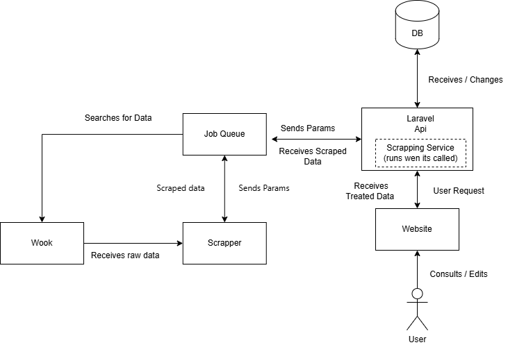
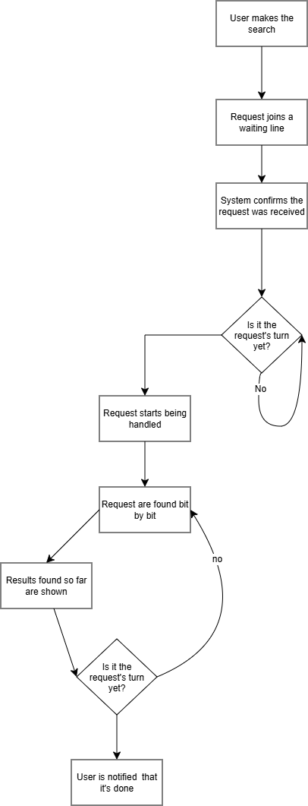
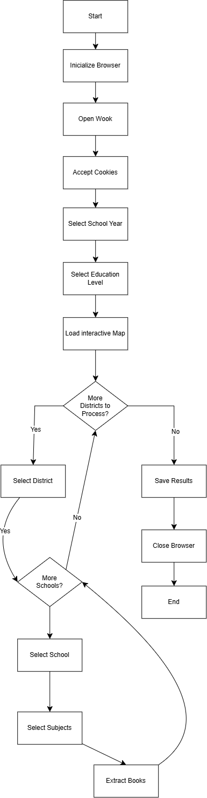

# WebScrapper — Scraping Service (Node.js)

Node.js microservice responsible for automatically collecting school textbook data from [wook.pt](https://www.wook.pt/comprar-manuais-escolares), using Playwright/Patchright/Camoufox. It receives scraping requests over HTTP, processes them asynchronously through a BullMQ/Redis queue, and sends the results back to the Laravel API via an authenticated HTTPS callback.

This service **has no database access**. All persistence is handled by the Laravel application, which consumes the results through the callback.

Related repositories:
- API/Backend (Laravel): [WebScrapperApi](https://github.com/ricardo4457/WebScrapperApi)
- Frontend (Vue 3): [WebScrapper-Frontend](https://github.com/ricardo4457/WebScrapper-Frontend)

---

## Requirements

- Node.js 18+ (`"type": "commonjs"` — no ESM syntax)
- Docker + Docker Compose (recommended)
- Redis
- Network access to the Laravel callback endpoint

---

## Running the project

### With Docker (recommended)

```bash
docker compose up -d
```

Starts three services: `redis`, `redis-insight` (monitoring UI at `localhost:5540`) and `scraper-worker`. The Express API runs in its own container (`scraper-api`) — see `Dockerfile`/`docker-compose.yml`.

### Locally

```bash
npm install
npx patchright install --with-deps chrome

node src/app.js              # HTTP API (port 3000)
node src/runner/JobRunner.js # BullMQ worker
```

---

## Environment variables

```env
# Redis / BullMQ
REDIS_HOST=localhost
REDIS_PORT=6379
SCRAPE_QUEUE_NAME=book-scraper

# Express API (/scrape route)
PORT=3000

# Browser
SCRAPER_ENGINE=chromium        # chromium (Patchright) | camoufox
SCRAPER_HEADLESS=true
MOZ_DISABLE_CONTENT_SANDBOX=1  # required for Camoufox to run in Docker

# Debug
SCRAPER_DEBUG=false
SCRAPER_DEBUG_DIR=debug
```

`callback_url` and `run_token` are **not** environment variables — they are sent by Laravel with every `POST /scrape` request and propagated through to the final callback.

---

## Architecture



- **Strategy layer** (`src/strategies`): decides *what* to search for (a single school, a city, a district, an entire teaching cycle). Has no dependency on BullMQ, Redis, Playwright, or HTTP.
- **Orchestration layer** (`src/runner`): receives the job from Express/BullMQ, runs the strategy, and distributes the discovered tasks across parallel *lanes* (`StrategyRunner`, `DiscoveryRunner`).
- **Execution layer** (`src/scrapper`): manages the browser (`BrowserManager`), navigates the site, extracts the books.
- **Communication layer** (`src/services`): streams results in batches (`ResultBatchService`) and sends the final callback (`ScrapeCallback`) to Laravel.

---

## Repository structure

```
src/
├── app.js                     # Express entry point (HTTP API)
├── routes/scrape.js           # POST /scrape and GET /scrape/:id
├── queue/ScrapeQueue.js       # BullMQ queue wrapper
├── runner/
│   ├── JobRunner.js           # BullMQ worker (entry point of the "scraper-worker" container)
│   ├── StrategyRunner.js      # Orchestrates a strategy's execution across parallel lanes
│   └── DiscoveryRunner.js     # Parallel discovery (cities/schools) used by the full_* strategies
├── strategies/
│   ├── StrategyFactory.js     # Maps strategy (string) → class
│   ├── ScrapeTask.js          # Task validation/normalization, lane partitioning
│   └── implementations/       # SingleSchoolStrategy, SingleSchoolStrategyTooltip,
│                               # FullCityStrategy, FullDistrictStrategy, FullTeachingCyleStrategy
├── scrapper/
│   ├── browser.js             # BrowserManager (Patchright/Camoufox)
│   ├── selectors.js           # CSS selectors/structure of the wook.pt site
│   ├── navigation/            # Combobox-based and map/tooltip-based navigation
│   ├── subjects.js, books.js  # Subject selection and book extraction
│   └── blockDetection.js      # Anti-bot/block detection
├── services/
│   ├── ScrapeCallback.js      # Authenticated POST to the Laravel callback
│   └── ResultBatchService.js  # Incremental streaming of results in batches
├── payloads/BookPayload.js    # Builds the payload expected by Laravel
├── jobs/ScraperJob.js         # Bridge between the BullMQ Worker and StrategyRunner
├── utils/                     # RunTimings, LaneContext, MergeExclusive, SanitizeJobData
└── config/redis.js, entrypoint.sh
```

---

## Supported strategies

| Strategy | Description |
| --- | --- |
| `single_school` | A specific school, combobox-based navigation. |
| `single_school_tooltip` | A specific school, map/tooltip-based navigation. |
| `full_city` | Every school in a municipality (school discovery). |
| `full_district` | Every school in a district (city → school discovery, parallelized via `DiscoveryRunner`). |
| `full_teaching_cycle` | Every course offered by a school (2nd/3rd cycle, secondary education). |

---

## HTTP API

### `POST /scrape`
Validates `strategy`, `callback_url`, and `run_token`, and creates a job on the `book-scraper` queue.

```json
{
  "strategy": "single_school",
  "year": "7.º",
  "teaching_cycle": "Ensino Básico (3º Ciclo)",
  "district": "Porto",
  "city": "Valongo",
  "school": "Colégio de Ermesinde - Escola Católica",
  "callback_url": "https://laravel.local/api/book-scraper/callback",
  "run_token": "..."
}
```

- `202 Accepted` — `{ job_tokens, jobs_total, status }`
- `400 Bad Request` — list of validation errors

### `GET /scrape/:id`
Checks the state (`state`, `progress`) of a job on the queue.

- `200 OK`
- `404 Not Found`

---

## Callback contract (worker → Laravel)

Sent by `ScrapeCallback`/`ResultBatchService` to `callback_url`, in batches during execution (`status: "partial"`) and as a final callback (`final: true`, `status: "completed" | "failed"`):

```json
{
  "run_token": "...",
  "job_token": "...",
  "attempt": 0,
  "status": "partial",
  "books": [
    {
      "school": { "name": "...", "district": "...", "city": "..." },
      "items": [
        {
          "title": "...", "publisher": "...", "authors": ["..."],
          "cover_path": "...", "price": 12.5,
          "discipline": "...", "type": "...",
          "year": "7.º", "teaching_cycle": "...", "course": null
        }
      ]
    }
  ]
}
```

`year` and `teaching_cycle` live inside each item of `items[]`, never at the `books[]` level.

---

## Tests

```bash
npm run test
```

Jest suite with Playwright/BullMQ mocks — covers `ScrapeTask`, `BookPayload`, `StrategyFactory`, `blockDetection`, `DiscoveryRunner`, `StrategyRunner`, and each strategy individually.

---

## Anti-detection

Supports two browser engines, configurable via `SCRAPER_ENGINE`:

- **Patchright** (Chromium) — avoids the CDP `Runtime.enable` command, the main detection vector used by vanilla Playwright.
- **Camoufox** (modified Firefox) — closer fingerprint to a real browser; higher resource usage, used as a fallback when Patchright gets blocked.

`src/scrapper/blockDetection.js` detects blocks by HTTP status code (403/429/503) and by text signals on the page (Cloudflare, "access denied", etc.), aborting the current lane without affecting the others.

---

## Flow diagrams

### Request queue

Each search request joins a queue and is processed in order of arrival. While a collection is running, results already found are shown to the user before the search fully completes.



### Initial scraping flow

Navigation sequence followed by the worker, from opening the browser to extracting a school's books: selecting year/cycle, district, school, and subjects, repeated for every school in a district when applicable.



---

## License

MIT — see [LICENSE](LICENSE).
